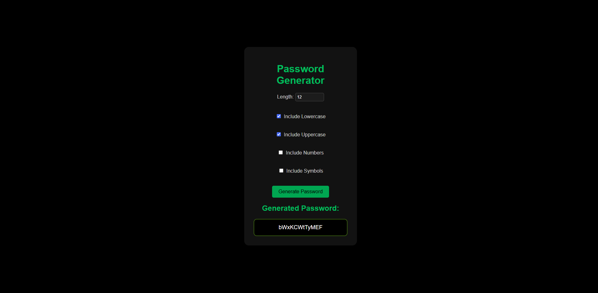

# 🔐 Random Password Generator

A clean, responsive and customizable **Random Password Generator** built using **HTML**, **CSS**, and **JavaScript**. Generate strong passwords with various options for better online security.

---

## 📸 Preview

Here's how the Password Generator looks in action:



---

## 🚀 Features

- ✅ Customizable password length
- 🔡 Include lowercase letters
- 🔠 Include uppercase letters
- 🔢 Include numbers
- 🔣 Include symbols
- 📋 Displays generated password clearly
- ⚠️ Shows an error if no character type is selected
- 💻 Fully responsive and styled with a sleek dark UI

---

## 💻 Tech Stack

- **HTML5** – Structure and layout
- **CSS3** – Responsive and modern dark UI
- **JavaScript** – Core password generation logic

---

## 📂 Project Structure

```
password-generator/
│
├── index.html      # Main webpage structure
├── style.css       # Custom dark theme styling
├── main.js         # JavaScript logic to generate password
└── demo.png        # Screenshot preview image
```

---

## ✨ Custom Styling Highlights

- AMOLED-friendly black background (`#000000`)
- Vibrant green accent (`#1DB954`) for buttons and headings
- Minimal and centered layout
- Password output styled for readability and copy-paste ease

---

## 🙌 Acknowledgements

- Inspired by a need for simple and strong password creation tools
- Color palette influenced by Spotify’s theme 🌿

---


## 🙏 Thank You

Thank you for checking out this project!  
If you liked it or found it useful, feel free to ⭐ star the repo or share your feedback!

---